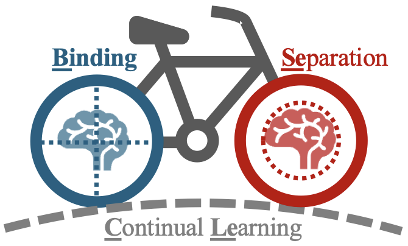
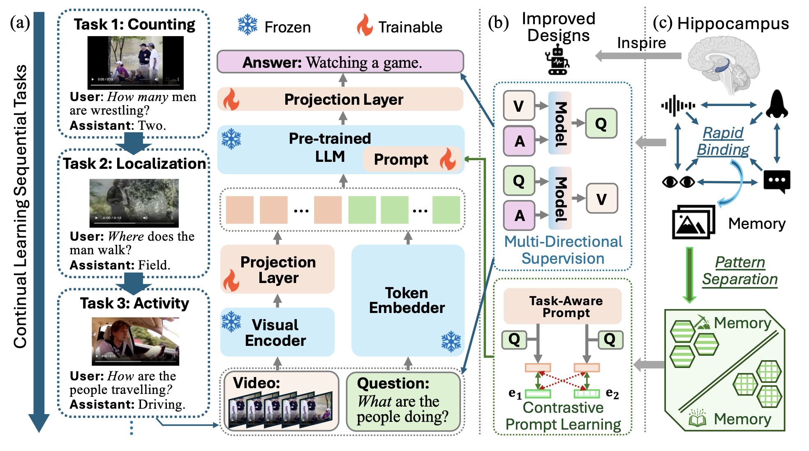
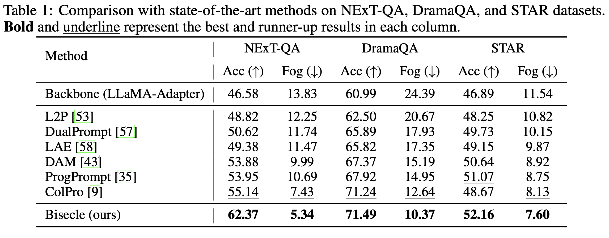
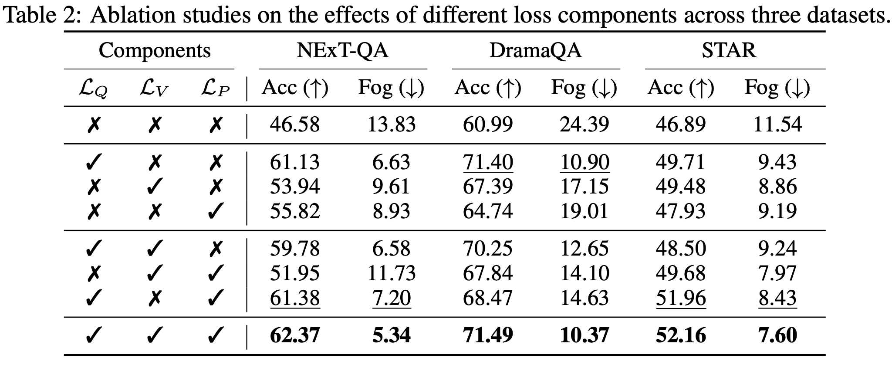
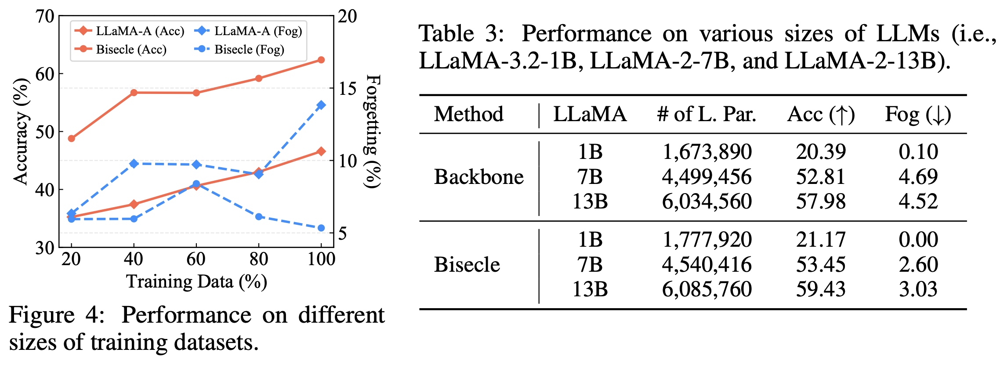
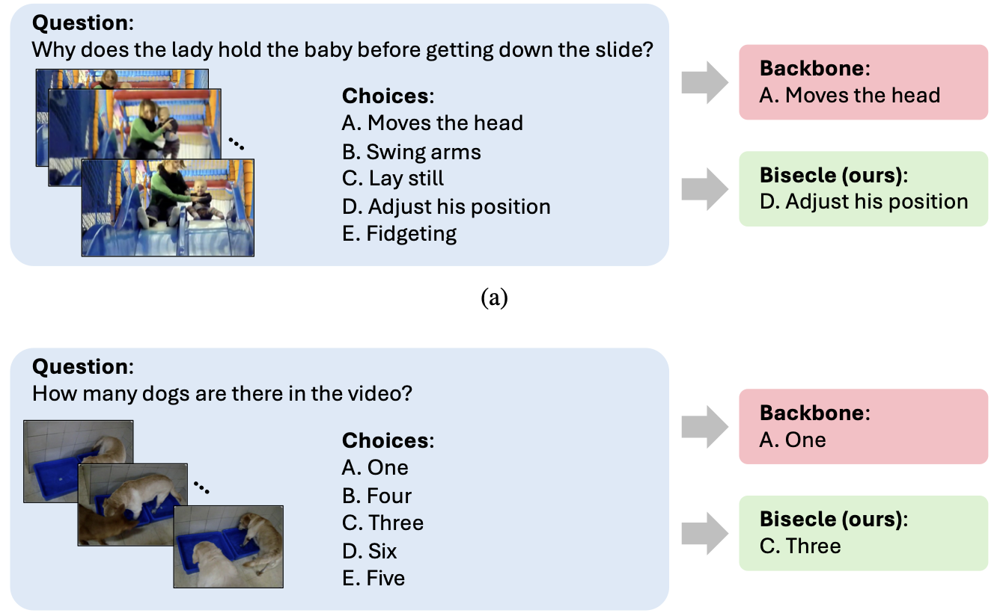
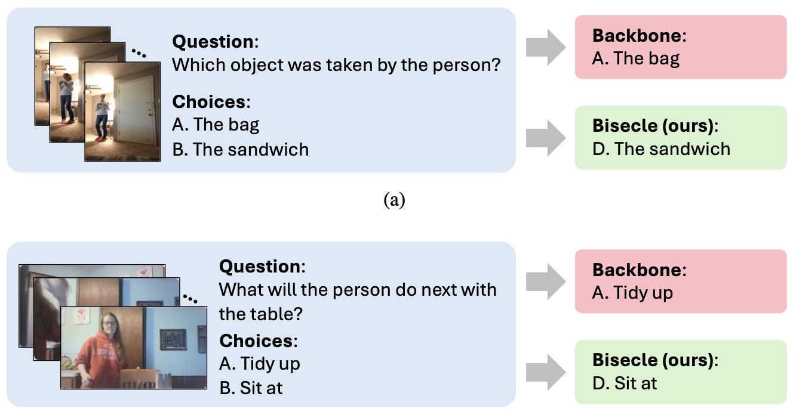

#  Bisecle: Binding and Separation in Continual Learning for Video Language Understanding

This repository provides the official implementation of **Bisecle**,

> **Bisecle: Binding and Separation in Continual Learning for Video Language Understanding**  
> *NeurIPS 2025*  
> Yue Tan, Xiaoqian Hu, Hao Xue, Celso M de Melo, Flora D. Salim  
> [[Paper](https://arxiv.org/pdf/2507.00469)]

Bisecle is a neurobiology-inspired continual learning framework specifically designed for multimodal video-language understanding tasks. It addresses the critical issues of **catastrophic forgetting**, **update conflict**, and **semantic overlap** across sequential video question answering tasks. The model leverages a multi-directional supervision module alongside a contrastive prompt learning mechanism, significantly enhancing model stability and generalization capabilities.


## 🧠 Core Contributions

1. **Multi-Directional Supervision Module**

Inspired by the mechanism of hippocampus to achieve rapid binding over multiple modalities, linking multimodal information dynamically into cohesive memory.

2. **Contrastive Prompt Learning**

Addresses inter-task prompt conflicts using contrastive learning, promoting semantic separation and preventing forgetting.


## 🏗️ Overall Framework

<p align="center">
  
</p>

Our framework comprises two key modules:
- **Multidirectional supervision**, which not only learns from standard VideoQA signals but also predicts one modality (e.g. questions) from others (videos and answers).
- **Contrastive prompt learning**, which encourages the model to learn both task-specific and task-shared prompt features for better generalisation across tasks.


## 📁 Project Structure
```bash
bisecle/
├── dataloader/ # Dataset configuration training and evaluation
├── llama/ # Tokenizer, implementation of model components (adapter layers, prompts, CL modules), model forward pass
├── util/ # Logger, scheduler, etc.
├── engine.py # Training engine including train_one_epoch and forward pass logic
├── lama_vqa.py # Define the baseline model for LLaMA-Adaptor
├── setup.sh # Environment setup file
├── train_dramaQA.py # Main training script for dramaQA
├── train_nextQA.py # Main training script for nextQA
└── train_starQA.py # Main training script for starQA
```

## 🔧 Installation

1. **Clone the repository:**

    ```
    git clone https://github.com/cruiseresearchgroup/bisecle.git
    cd bisecle
    ```

2. **Setup environment (recommended):**

    ```
    conda create -n bisecle python=3.10 -y
    conda activate bisecle
    ```

3. **Install dependencies:**

    ```
    bash setup.sh
    ```

    *Alternatively, you can manually install the modules in setup.sh:*
    
    
## 🔧 Running the experiments


The baseline experiment trains the model in the conventional way.

* To fine-tune the model with Bisecle on NExT-QA:
```
python train_nextQA.py --batch_size 32 --adapter_layer 32 --tqcp_weight 0.1 --weight_decay 0.14
```
* To fine-tune the model with Bisecle on DramaQA:
```
python train_dramaQA.py --batch_size 4 --adapter_layer 32 --tqcp_weight 1 --weight_decay 0.1
```
* To fine-tune the model with Bisecle on STAR:
```
python train_starQA.py --batch_size 16 --adapter_layer 32 --tqcp_weight 0.1 --weight_decay 0.1
```

## 📊 Experimental Results

Bisecle achieves state-of-the-art performance in continual VideoQA on three popular benchmarks: **NExT-QA, DramaQA, and STAR**.

<p align="center">
  
</p>

## 🔍 Ablation Studies

### 1. Effect of different loss components
We find that the loss terms $\mathcal{L}_Q$ and $\mathcal{L}_P$ contribute most to the overall performance.

<p align="center">
  
</p>

### 2. Robustness to data and model size
Bisecle remains robust in limited-data settings and performs consistently across different LLM-based backbone sizes.

<p align="center">
  
</p>


## 🎨 Qualitative Results

We show representative qualitative examples from Bisecle illustrating:
- how our model reasons over complex video–question interactions, and  
- how it maintains consistent predictions across tasks in a continual setting.

<p align="center">
  
  
</p>


## 📝 Citation
If you find this work helpful, please consider citing:
```bash
@article{tan2025bisecle,
  title={Bisecle: Binding and Separation in Continual Learning for Video Language Understanding},
  author={Tan, Yue and Hu, Xiaoqian and Xue, Hao and De Melo, Celso and Salim, Flora D},
  journal={arXiv preprint arXiv:2507.00469},
  year={2025}
}
```
